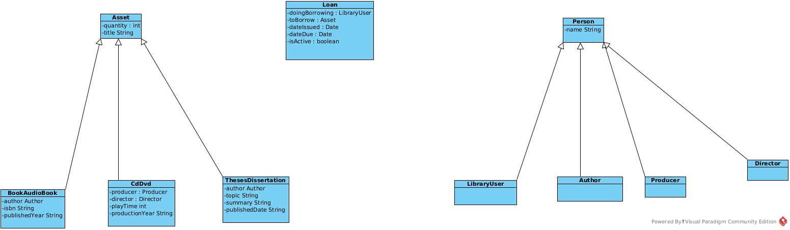

# Library catalogue system (LCS)

## Introduction

The library catalogue system consists of three distinct packages: `interactor`, `library`, and `util`. Each is described at a high level and some design decisions are explained in a little more detail.

## Package `interactor`: user interaction

### Overview

This package contains the main menu, submenus, and menu options that are presented to the user. It also contains the system's `main` method and entry point.

Separating the interaction logic from the business rules means it's easier to change one without affecting the other. It also benefitted collaboration by allowing developers to work on distinct subsystems. Merge conflicts were rare, and those that did come up were easy to resolve.

### All interactions in one collection

When the program runs, one of the first things it does is load all interactions -- i.e. objects whose classes extend the `Interaction` class or one of its children. This ensures that every menu is loaded and available, and the program remains responsive throughout.

All interactions are stored in `HashMap<String, Interaction> allInteractions`: a collection of String identifiers for Interaction objects.

- The strings are all literals that refer to the functionality they enable
- The objects are created by unique classes, each of which is instantiated exactly once in the program's lifetime

Each `Interaction` object has a method `requestAndResponse()` which handles user interaction. This method optionally determines the next menu to present by setting field `String nextReference`; by default any given menu will refer to "main" (the main menu) as the next menu to present.

Interaction objects are split into two general categories:

1. **Functionality:** the user is optionally asked for a prompt (for example, when adding a new library customer, the user is asked to enter the new customer's name) and is almost always presented with some kind of output: a list of assets, a confirmation of an action, etc
2. **Menus:** the user is presented with a list of 2 or more options, plus a 'Back' option. These listed options represent either a submenu or functionality.

User menus are created in the Interactor class. This class is instantiated exactly once, in the program's main method, and handles all user interaction. Its constructor calls a private method that builds up the HashMap of interactions by instantiating a unique class for each menu Interaction or functionality Interaction. The main menu and the main menu's submenus are each constructed in a dedicated method for the sake of organisation.

Menu items are objects of type MenuItem. Each MenuItem takes a String description -- which is presented to the user -- and a String nextInteractionReference which is a key in the allInteractions HashMap. When the user enters their choice for a given menu option, the nextInteractionReference field of the menu is set to the value of the chosen menu item. On the next iteration of the event loop, that new Interaction is presented.

## Package `library`: system logic

## Package `util`: utility classes

