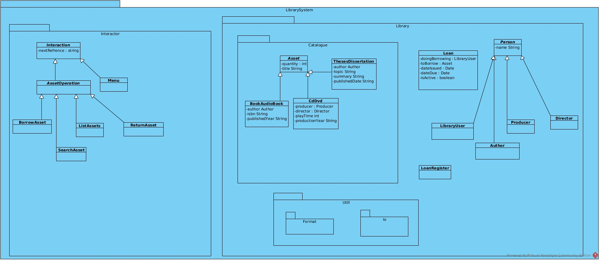

# Library catalogue system (LCS)

## Introduction

The library catalogue system consists of three distinct packages: `interactor`, `library`, and `util`. Each is described at a high level and some design decisions are explained in a little more detail.

## Package `interactor`: user interaction

### Overview

This package contains the main menu, submenus, and menu options that are presented to the user. It also contains the system's `main` method and entry point.

Separating the interaction logic from the business rules means it's easier to change one without affecting the other. It also benefitted collaboration by allowing developers to work on distinct subsystems. Merge conflicts were rare, and those that did come up were easy to resolve.

### All interactions in one collection

When the program runs, one of the first things it does is load all interactions -- i.e. objects whose classes extend the `Interaction` class or one of its children. This ensures that every menu is loaded and available, and the program remains responsive throughout.

All interactions are stored in `HashMap<String, Interaction> allInteractions`: a collection of String identifiers for Interaction objects.

- The strings are all literals that refer to the functionality they enable
- The objects are created by unique classes, each of which is instantiated exactly once in the program's lifetime

Each `Interaction` object has a method `requestAndResponse()` which handles user interaction. This method optionally determines the next menu to present by setting field `String nextReference`; by default any given menu will refer to "main" (the main menu) as the next menu to present.

Interaction objects are split into two general categories:

1. **Functionality:** the user is optionally asked for a prompt (for example, when adding a new library customer, the user is asked to enter the new customer's name) and is almost always presented with some kind of output: a list of assets, a confirmation of an action, etc
2. **Menus:** the user is presented with a list of 2 or more options, plus a 'Back' option. These listed options represent either a submenu or functionality.

User menus are created in the Interactor class. This class is instantiated exactly once, in the program's main method, and handles all user interaction. Its constructor calls a private method that builds up the HashMap of interactions by instantiating a unique class for each menu Interaction or functionality Interaction. The main menu and the main menu's submenus are each constructed in a dedicated method for the sake of organisation.

Menu items are objects of type MenuItem. Each MenuItem takes a `String description`, which is presented to the user, and a `String nextInteractionReference` which is a key in the allInteractions HashMap. When the user enters their choice for a given menu option, the nextInteractionReference field of the menu is set to the value of the chosen menu item. On the next iteration of the event loop, that new Interaction is presented.

## Package `library`: system logic

### Overview

This package contains the system logic that is used by the interactor package. The library interface defines methods that can be called on the `Library` type which gets passed into every event loop call. These methods are implemented by `LibraryManagement`. Methods that interact with the catalogue of assets are passed on to the library's copy of the `Catalogue` object.

### Loans as a class

While a loan is not a real-world object, defining the occurrence of a loan as a type simplifies development. Once a Loan object exists, there is no reason to differentiate between items in the *catalogue* -- which represents a record of what the library has available -- and the actual *books on shelves*.

An entry in the library catalogue will have a title, creator, and quantity, as well as other fields such as an ISBN number (book) or play time (CD). However, such an entry itself cannot be loaned out -- only the actual asset can.

The choice was the following:

1. Treat each record in the catalogue as *also* representing the actual books
2. Record loans of assets separately from the catalogue

The `catalogue` package and its `Catalogue` interface are only a catalogue, and not a record of loans. This again ensures separation of concerns. Now when the library needs to check whether a given item in the catalogue is available, it just checks that asset against all currently active loans and counts how many times the asset is already loaned out. If that number is less than the total quantity of the asset in the catalogue, the asset must be available.

## Package `util`: utility classes

### Overview

The utility package is a collection of loosely related classes with exclusively static methods. Such methods can be used for common operations that do not need to know the current state of an object, but only turn a given input into output according to internal rules.

### `StringFormat`

There are many instances where some list of assets or users needs to be prefixed with a header row and printed in a uniform way. Thanks to the StringFormat class, this is easy and straightforward to do.

### `io`: input/output

#### Standard input

User input from stdin has a habit of making program logic difficult to follow, which in turn makes it difficult to improve. Instead of having `System.out.println()` sprinkled through the business logic, it's much nicer to be able to call a static method that takes a prompt and a response pattern as input and only returns once the user's input matches the provided response pattern.

#### Files

Reading and writing files is not *as* messy as user input, but it does involve something that user input typically doesn't: exception handling. Calling a read or write operation can obviously result in exceptions being thrown: the file does not exist, the user does not have sufficient access, etc.

### `Search`

Finally, having a flexible method for searching any collection keeps the search logic and ugly iterations out of the business logic. `public static boolean matchQuery(Searchable haystack, String needle)` is an example of a straightforward function that simply matches a String query to any of the fields that are exposed by the `Searchable` type. If any field matches, return true; if not, return false. This method is used to filter collections of authors, users, and assets.

Similar functionality can be achieved using Java's `stream()` API by linking calls to `filter()` and `collect()`.
